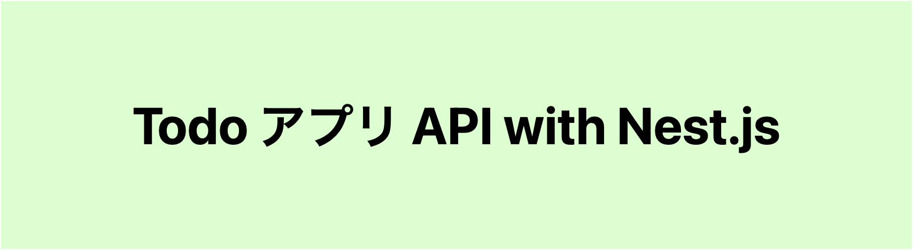

# todo-nest

TodoアプリAPIをNest.jsでつくる

---

## backend service architecture

| スタック       | ツール名    |
| -------------- | ----------- |
| 言語           | typescript  |
| ライブラリ     | typeORM     |
| フレームワーク | NestJs      |
| DB             | PlanetScale |
| インフラ       | Cloud Run   |
| テストツール   | Jest        |

## frontend service architecture

| スタック       | ツール名   |
| -------------- | ---------- |
| 言語           | typescript |
| ライブラリ     | React      |
| フレームワーク | Vite       |
| ホスティング   | Firebase   |
| テストツール   | Jest       |

## software architecture

- DDD
- クリーンアーキテクチャ

## How development

- TDD
